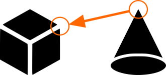

# Vertex Based Align Tool for Blender

A Blender add-on that allows you to align objects using marked vertices with optional rotation alignment.

## Features

- **Position Alignment**: Align one object to another using a single vertex on each object
- **Position + Rotation Alignment**: Align both position and rotation using two vertices on each object
- **Smart Detection**: Single "Align" button automatically detects whether to apply rotation based on marked vertices
- **Clear Visual Feedback**: Panel shows all marked vertices for both source and target objects
- **Easy Workflow**: Simple step-by-step process with clear instructions

## Installation

1. Download the latest release: [`vertex_based_align.py`](vertex_based_align.py)
2. Open Blender
3. Go to **Edit > Preferences > Add-ons**
4. Click **Install** and select the downloaded `.py` file
5. Enable the add-on by checking the box next to "Object: Vertex Based Align Tool"

## Usage

### Position Only Alignment

Use this when you only want to move an object to match a vertex position.

1. Select the **source object** (the one you want to move)
2. Enter **Edit Mode** (Tab)
3. Select a vertex on the source object
4. In the sidebar (press N), go to the **Vertex Based Align Tool** tab
5. Click **Mark Source Vertex 1**
6. Select the **target object**
7. Enter **Edit Mode** and select a vertex
8. Click **Mark Target Vertex 1**
9. Click **Align objects**

The source object will move so that its marked vertex matches the position of the target vertex.

### Position + Rotation Alignment

Use this when you want to align both position and orientation using two vertices on each object.

1. Select the **source object**
2. Enter **Edit Mode**
3. Select the first vertex (origin point)
4. Click **Mark Source Vertex 1**
5. Select the second vertex (defines direction)
6. Click **Mark Source Vertex 2**
7. Select the **target object**
8. Enter **Edit Mode** and select the first vertex
9. Click **Mark Target Vertex 1**
10. Select the second vertex (defines target direction)
11. Click **Mark Target Vertex 2**
12. Click **Align objects**

The source object will be rotated and moved so that:
- Source Vertex 1 aligns with Target Vertex 1
- The vector from Source Vertex 1→2 aligns with the vector from Target Vertex 1→2

## Interface

The add-on adds a **Vertex Based Align Tool** panel in the 3D Viewport sidebar (press N to open).

**Panel sections:**
- **Source Object**: Shows the marked source object and its vertices
- **Target Object**: Shows the marked target object and its vertices
- **Mark Source Vertices**: Buttons to mark vertices on the source object
- **Mark Target Vertices**: Buttons to mark vertices on the target object
- **Align objects**: Smart button that automatically detects the alignment mode
- **Clear All**: Removes all marked vertices

## Use Cases

- Precisely positioning objects in architectural modeling
- Aligning mechanical parts in hard-surface modeling
- Matching reference points between different objects
- Snap-fitting modular assets
- Aligning imported objects to scene geometry

## Requirements

- Blender 3.0 or higher

## Tips

- The "Align objects" button text changes to show whether it will apply rotation or position only
- You can mark Vertex 2 on only one object pair - the add-on will automatically do position-only alignment
- Use the "Clear All" button to quickly reset all marked vertices
- Vertices are marked by index, so they remain valid even if you modify the mesh

## Known Limitations

- Works only with mesh objects
- Requires Edit Mode to mark vertices
- The add-on stores vertex indices, so if you delete vertices, the indices may become invalid

## License

This project is licensed under the MIT License - see the [LICENSE](LICENSE) file for details.

## Contributing

Contributions are welcome! Please feel free to submit a Pull Request.

## Support

If you encounter any issues or have suggestions for improvements, please open an issue on GitHub.

## Changelog

### Version 3.0.0
- Added explicit target vertex marking
- Implemented smart single "Align objects" button
- Improved UI with separate source and target sections
- Enhanced visual feedback for marked vertices

### Version 2.0.0
- Added rotation alignment feature
- Support for marking two vertices per object

### Version 1.0.0
- Initial release
- Basic position-only alignment
